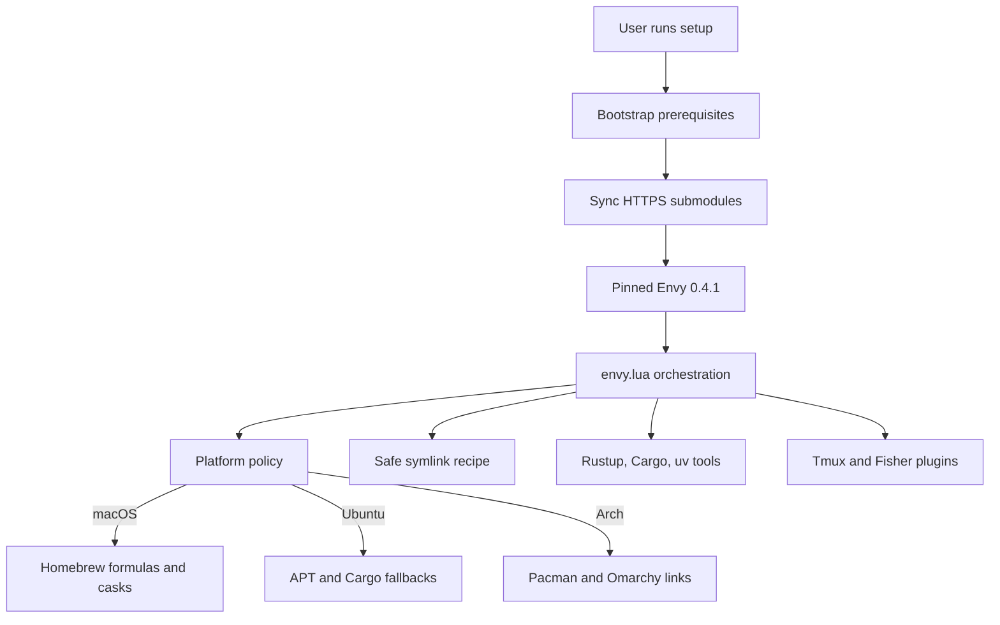
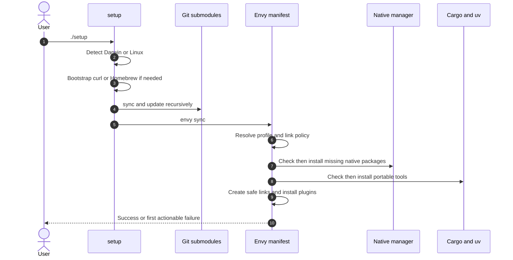

# Cross-Platform Envy Maintainer Guide

## Purpose

This repository is intended to produce one consistent development environment on macOS, Ubuntu, and Arch Linux without pretending those systems are identical. The manifest shares portable configuration and tools, maps native package names explicitly, and keeps desktop-specific configuration on the platform that owns it.

This guide records the strategy and invariants established during the cross-platform migration. Its primary audience is the next engineer or agent diagnosing a setup failure on a machine other than the one where a change was written.

### Supported baseline

| Profile | Detection | Native manager | Desktop additions | Portable fallback |
| --- | --- | --- | --- | --- |
| macOS | `envy.PLATFORM == "darwin"` | Homebrew formulas and casks | Aerospace | None currently |
| Ubuntu 24.04+ | Linux with `apt-get` and `dpkg-query` | APT | None | Selected Rust tools through Cargo |
| Arch Linux x86_64 | Linux with `pacman` | Pacman | Hyprland/Omarchy overrides | None currently |

Pacman takes precedence if both Pacman and APT commands are visible. Other Linux distributions and Windows are deliberately unsupported. Arch-specific configuration must remain in user-owned `~/.config` paths; never modify packaged Omarchy source under `/usr/share/omarchy` (or the older `~/.local/share/omarchy` location).

## Goals and non-goals

The goals are:

- One `./setup` entry point on every supported platform.
- Native managers for system libraries and tools that are reliably packaged.
- Portable installers only where native repositories cannot provide a tool cleanly.
- Shared dotfiles everywhere, with explicit macOS- and Arch-only link sets.
- Idempotent reruns that preserve user-owned files and directories.
- Tests that catch package-name drift before a real installation reaches `sudo`.

The non-goals are exact package-source parity, automatic support for every APT- or Pacman-based distribution, installing unavailable Ubuntu GUI applications from third-party repositories, replacing existing dotfiles automatically, or treating CI metadata checks as full installation tests.

## Architecture

The manifest is intentionally an orchestrator. Platform decisions live in one policy module, while host mutations live in small Envy setup recipes.



### File responsibilities

| File | Responsibility |
| --- | --- |
| `setup` | Bootstraps curl/Homebrew, verifies prerequisites, synchronizes submodule URLs, initializes submodules, then executes Envy. |
| `bin/envy` | Locates the manifest and downloads/runs the Envy version pinned by its directives. |
| `envy.lua` | Builds the package graph, common links, generated AI-skill links, and post-install plugin tasks. |
| `envy/platform.lua` | Detects the profile and returns native packages, casks, taps, Cargo fallbacks, and desktop-specific links. This is the source of truth for platform differences. |
| `envy/local.system_packages@r0.lua` | Checks and installs formulas, casks, APT packages, or Pacman packages. |
| `envy/local.symlink@r0.lua` | Classifies destinations, warns on conflicts, and creates or repairs only safe links. |
| `envy/local.cargo_install@r0.lua` | Installs Git-based tools and Ubuntu's crates.io fallbacks after the stable Rust toolchain exists. |
| `bin/update` | Updates the active native manager and the portable tools installed for that profile. |
| `tests/` | Tests profile resolution, symlink behavior, and live native-repository metadata. |

## Setup flow

`setup` owns prerequisites that must exist before Envy can evaluate recipes. Everything else belongs in the manifest or a recipe.



Submodule URLs are HTTPS so a fresh public checkout does not depend on GitHub SSH credentials. Homebrew is bootstrapped only on macOS; APT and Pacman are assumed to be part of their operating systems.

## Package strategy

### Rules to preserve

1. Put shared native package names in `common_packages` only when all three managers use that exact name.
2. Put name differences in `package_aliases`. Keys are manager names (`brew`, `apt`, and `pacman`), not operating-system names.
3. Put platform-only formulas/packages in the matching profile branch.
4. Keep Homebrew GUI applications in `casks`, not `packages`, and declare required taps separately.
5. Use Cargo fallback entries only for portable command-line tools missing from the supported Ubuntu repositories. Keep system libraries in APT.
6. Prefer official Ubuntu and Arch repositories. Do not add an AUR helper or third-party APT repository merely to force package parity.
7. When a portable tool is added, update `bin/update` if that profile installs it outside the native manager.

Package names are manager-specific identifiers, not necessarily project, crate, or executable names. For example:

| Tool/executable | Homebrew | Ubuntu | Arch |
| --- | --- | --- | --- |
| GitHub CLI (`gh`) | `gh` | `gh` | `github-cli` |
| fd (`fd`) | `fd` | `fd-find` | `fd` |
| Ninja | `ninja` | `ninja-build` | `ninja` |
| typos (`typos`) | `typos-cli` | Cargo crate `typos-cli` | `typos` |

The last row is an important regression case. The initial Arch profile used `typos-cli`, which is a valid crate/Homebrew name but not an official Pacman target. The correct Arch package is `typos`.

### Ubuntu fallbacks

Ubuntu currently installs `diskus`, `eza`, `git-delta`, `gping`, `hexyl`, `typos-cli`, and `yazi-build` through Cargo. The `yazi-build` installer provides both `yazi-fm` and `yazi-cli` and requires Cargo's `--force` flag. Ghostty and Lazygit are not automatically installed on Ubuntu. Reconsider these choices only when Ubuntu's supported baseline provides a reliable native package or the upstream installation model changes.

## Symlink safety contract

Regular dotfiles and generated AI-skill links go through the same recipe. A future implementation must retain this behavior:

| Destination state | Result |
| --- | --- |
| Missing | Create its parent and the symlink. |
| Correct symlink | Treat as satisfied. |
| Stale or broken symlink | Replace it safely. |
| Real file | Adopt an identical copy as a symlink; warn and preserve a differing file. |
| Real directory | Warn, preserve it, and continue; never link the source inside it. |

All shell paths must be quoted. Conflicts intentionally do not fail the entire sync because unrelated links and packages should still converge. If an older run created a nested link inside a real directory, the warning points out the possible nested path but does not remove it.

Desktop link invariants:

- Common links apply to all supported profiles.
- `config/aerospace.toml` is linked only on macOS.
- The eight explicitly managed Hyprland files are linked individually only on Arch: `autostart.lua`, `bindings.lua`, `hyprland.lua`, `hyprsunset.conf`, `input.lua`, `looknfeel.lua`, `monitors.lua`, and `xdph.conf`. The directory remains available for files Omarchy may add later.
- Ubuntu receives neither desktop-specific set.

### Omarchy v4.0.4 cutover

The repository targets [Omarchy v4.0.4](https://github.com/omacom/omarchy/releases/tag/v4.0.4). Hyprland loads its packaged Lua bootstrap and defaults before personal modules; missing release modules are errors, not a reason to fall back to `.conf`. Quickshell replaces Waybar, Walker, hypridle, and hyprlock. The old Waybar/Walker files are not deployed. `hyprsunset.conf` and `xdph.conf` retain their native syntax.

The native idle defaults are 150 seconds to screensaver and 300 seconds to lock, both measured from the last activity. No `shell.json` override or old 152-second workaround is needed. The native lock screen replaces the old hyprlock appearance. Preserve fingerprint enrollment, drivers, and PAM; see the [v4 fingerprint migration guidance](omarchy-t480s-fingerprint.md#omarchy-v4-lock-migration).

**Live target verification is still required.** Repository tests and isolated deployment exercises do not validate a compositor, physical keys, display hardware, or authentication. `setup` accepts numeric Omarchy versions 4.0+ with the Lua bootstrap present; the personal configuration was developed against v4.0.4.

1. Run `omarchy version` as the desktop user in the running target session. Finish the supported upgrade/reboot before deployment. On Omarchy 3, first back up and detach repository-owned links into equivalent regular copies before the separate supported Quattro upgrade: its upgrader can otherwise write through links into tracked files. Do not reload the Lua configuration into an old session.
2. **Before updating this checkout or moving any destination**, create a backup. Run these commands in a Bash subshell on the target; any copy error aborts:

   ```sh
   (
     set -eu
     backup=$(mktemp -d "$HOME/omarchy-config-backup.XXXXXX")
     printf 'Keep this backup path: %s\n' "$backup"
     cp -a -- "$HOME/.config/hypr" "$backup/hypr-links"
     cp -aL -- "$HOME/.config/hypr" "$backup/hypr-resolved"
   )
   ```

   `hypr-links` records original per-file symlink targets and regular files; `hypr-resolved` saves dereferenced contents. If an old source is already missing, the first copy preserves its dangling-link metadata and the second reports the unavailable path and fails. Stop there: the resolved backup is incomplete, not proof that those bytes were saved. Recover missing content before starting a fresh backup/cutover. Keep the printed backup path for the remaining steps.
3. Update the target checkout only after the pre-update backup succeeds. Then run `./setup --omarchy-config` as the desktop user inside the upgraded session. This performs only the configuration cutover; plain `./setup` performs the same cutover before normal package/tool setup. Explicit Envy arguments are forwarded without the automatic cutover, so package selection does not implicitly deploy the desktop.
4. `envy/omarchy_setup.lua` obtains the eight records from `platform.desktop_links`, rejects real directory destinations and unsupported file types before moving anything, and verifies source files and Lua syntax. It refuses a directory-wide Hypr symlink rather than mutating an unexpected tree.
5. When changes are needed, the helper creates another `~/omarchy-config-backup.*` containing original files/link targets in `hypr-links` and dereferenced contents in `hypr-resolved`. Already dangling top-level links are recorded in `unavailable` and reported; their metadata is retained, but their missing bytes cannot be recovered. Other copy failures, including unreadable or dangling nested content, abort before destinations move.
6. Correct links remain intact. Differing files and symlinks move into `displaced`, then the existing safe symlink recipe installs dependencies before `hyprland.lua`. The helper verifies every link target and its readable source, runs `hyprctl reload`, and requires `hyprctl configerrors` to contain no non-whitespace diagnostics. Plain text avoids treating Hyprland's JSON `[""]` response as an error. Command failures and real diagnostics still fail validation. A warning-only recipe check is not proof of adoption.
7. Installation or compositor-validation failure restores the displaced destinations and removes newly installed managed links. It attempts to reload the restored configuration and reports any restore/reload errors; keep the printed backup path for diagnosis. Unexpected concurrent changes are not overwritten. Only this managed set is restored; unrelated files and the checkout are not rewritten. If the restored files cannot load, use the pre-update resolved backup for manual recovery.
8. Only after successful validation, the helper moves the nine retired `.conf` links into the backup's `retired` directory: `autostart`, `bindings`, `envs`, `hypridle`, `hyprland`, `hyprlock`, `input`, `looknfeel`, `monitors`. Each must point exactly to this checkout's corresponding old source. Foreign links and old regular files stay untouched. A second run with all links correct performs a reload/check without creating another backup.

Keep both backups and complete the live checks below. No authentication packages or PAM files are changed by setup; the separate fingerprint guidance still applies.

### Live Omarchy verification

Run as the desktop user, with the running v4.0.4 session's IPC environment:

```sh
omarchy version
hyprctl reload
hyprctl configerrors
hyprctl -j binds
hyprctl -j monitors
hyprctl getoption input.kb_options
hyprctl getoption input.repeat_delay
hyprctl getoption input.touchpad.scroll_factor
omarchy toggle idle status
fprintd-list "$USER"
omarchy-shell lock status
```

Require no configuration errors, one root-menu action and no Display action on Super+Ctrl+D, and no bindings on Super+Space, Super+Alt+Space, Super+K, or Super+W. The connected `eDP-1` must report scale 1.25. Input values must be `ctrl:nocaps,altwin:swap_alt_win`, `600`, and `0.1`. Idle timers must report 150/300 unless an existing machine-level override explicitly changes them.

Manually verify Super+Return opens one terminal in the active terminal's directory; Super+Shift+O launches/focuses Obsidian with `-disable-gpu --enable-wayland-ime`; Super+Ctrl+D opens only the root menu; Super+Q closes a disposable focused window. Verify physical Alt/Win swapping and Caps-as-Control. Reload a second time and check that bindings do not multiply. Use `omarchy system lock` and verify password access and the existing enrolled fingerprint on hardware where it worked previously.

Never run `omarchy refresh hyprland` as validation: v4.0.4 overwrites personal Lua files with defaults. Use `./setup --omarchy-config`, not plain `./setup`, for configuration-only deployment.

## Validation workflow

Run the non-mutating checks before a full setup:

```sh
./bin/envy lua tests/platform_test.lua
./bin/envy lua tests/local_specs_test.lua
./bin/envy lua tests/symlink_test.lua
./bin/envy lua tests/omarchy_setup_test.lua
bash -n setup bin/update tests/package_metadata.sh
./bin/envy lua envy.lua
git diff --check
```

Then validate the active repository metadata without installing the packages:

```sh
tests/package_metadata.sh macos   # on macOS
tests/package_metadata.sh ubuntu  # on Ubuntu 24.04+
tests/package_metadata.sh arch    # on Arch
```

The metadata test generates its package list from `envy/platform.lua`; do not duplicate the list in shell. `tests/package_list.lua` must terminate every `envy.stdout` record with `\n`. A missing newline previously concatenated every package into one stream, caused the shell loop to perform zero useful checks, and allowed an invalid Arch package name to pass.

After the non-mutating checks pass, run `./setup` on the target platform and then run it a second time. The first run validates real installation and password/permission behavior; the second validates idempotency. Do not call a platform supported solely because metadata lookup passed.

GitHub Actions runs policy, symlink, syntax, and native metadata checks on Ubuntu 24.04, macOS 14, and an Arch container. These jobs query package repositories but do not fully provision a machine.

## Troubleshooting

### Native manager reports “target/package not found”

1. Copy the exact manager command and package name from the Envy error.
2. Query that platform directly:

   ```sh
   pacman -Si PACKAGE
   apt-cache show PACKAGE
   brew info --formula PACKAGE
   brew info --cask PACKAGE
   ```

3. Search for the executable/project under its platform-specific name.
4. Correct `envy/platform.lua`; do not special-case the installer recipe for a single package.
5. Add an explicit assertion to `tests/platform_test.lua` when the alias is non-obvious.
6. Run the complete metadata test, then retry `./setup`. Envy checks installed state, so a failed partial run is safe to rerun.

### `sudo` authentication fails

Treat authentication and package resolution as separate failures. Retry with a valid password, but inspect any manager error printed after authentication. Envy deliberately uses interactive execution for APT and Pacman so `sudo` can prompt through the terminal.

### Homebrew formula/cask failure

Confirm whether the item is a formula or cask and whether it requires a tap. `brew list --formula`, `brew list --cask`, and `brew tap` are checked separately by the system-package recipe.

### Cargo or uv is missing during the same sync

The dependent recipes look in `~/.cargo/bin` and `~/.local/bin` as well as `PATH`, because installers cannot always update the already-running Envy process environment. Preserve that behavior when changing installers.

### An existing directory produces a symlink warning

This is expected safety behavior. Inspect the destination, merge or move its contents manually, remove the conflicting destination only when it is safe, and rerun setup. Never change the recipe to use a recursive or forced replacement for real directories.

### Envy recipe failure

Use the spec identity, phase, options, command, and stderr included in Envy's error. Load the manifest and individual specs without installing anything:

```sh
./bin/envy lua envy.lua
for file in envy/local.*@r0.lua; do
  ./bin/envy lua "$file" || break
done
```

## Change checklist

When changing platform behavior:

- Update the policy in `envy/platform.lua`, keeping `envy.lua` orchestration-only.
- Update the profile assertions in `tests/platform_test.lua`.
- Run `tests/package_metadata.sh PROFILE` on the affected operating system.
- Update `bin/update` if the install source is not the native manager.
- Test both a clean destination and an existing dotfile directory if links change.
- Verify no macOS link reaches Linux and no Hyprland/Omarchy link reaches macOS or Ubuntu.
- Keep public submodules on HTTPS.
- Update this guide when an invariant, supported baseline, or fallback changes.

## Session history and current validation status

The cross-platform migration:

- Upgraded the local Envy recipes to the Envy 0.0.64 `USER_MANAGED`/named `SETUP` model.
- Replaced separate Brew, APT, and Pacman recipes with one system-package recipe.
- Centralized platform package and desktop-link decisions.
- Added macOS Homebrew bootstrap and cross-platform submodule initialization.
- Added official-installer paths for Rustup and uv plus Cargo fallbacks for Ubuntu.
- Unified dotfile and AI-skill linking under the safe conflict policy.
- Added macOS, Ubuntu, and Arch CI metadata coverage.
- Corrected Arch `typos-cli` to `typos` and fixed the metadata test that initially missed it.

Local validation has covered policy resolution, symlink states, Lua spec loading, shell syntax, workflow YAML parsing, and the complete Arch package metadata list. A future maintainer should record full clean-machine results for macOS and Ubuntu when they are available; CI metadata success alone is not proof of a successful end-to-end setup.

## Agent handoff template

When handing an unresolved platform failure to another agent, include:

```text
Platform/profile:
OS version and architecture:
Fresh machine or existing dotfiles:
Commit under test:
Command executed:
First failing Envy spec and phase:
Exact generated command:
Complete stdout/stderr:
Native metadata query and result:
Tests already run:
Files changed during diagnosis:
Whether rerunning setup is safe:
```

Start with the first failing spec, not later cascading errors. Preserve the user's existing files, avoid full-system mutations during diagnosis, and keep platform decisions centralized in the policy module.
