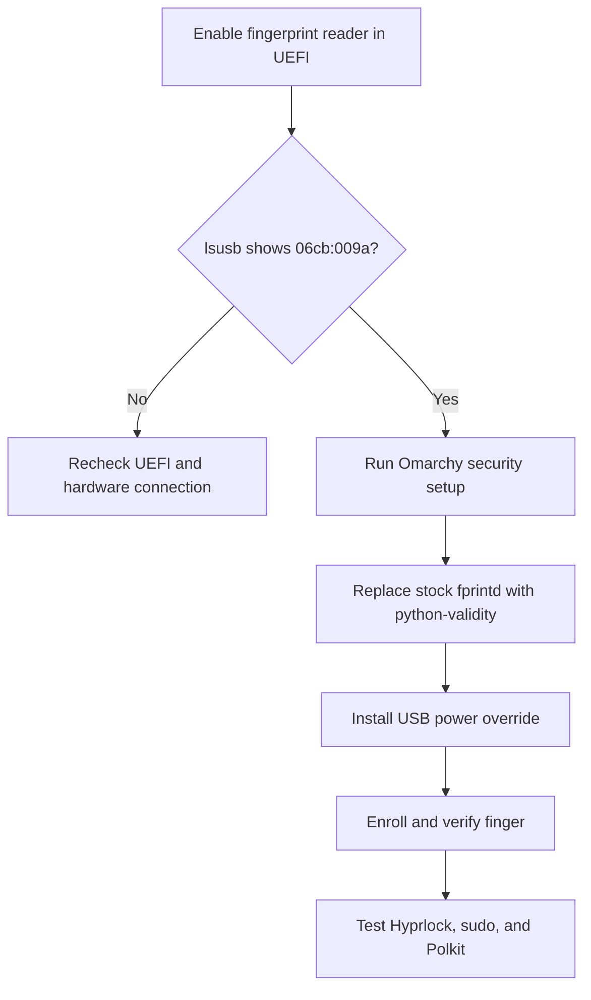

# ThinkPad T480s Fingerprint Setup on Omarchy

## Purpose

This runbook reproduces the working fingerprint configuration for the Lenovo ThinkPad T480s model `20L7CTO1WW`. Its built-in reader identifies as `06cb:009a Synaptics Metallica MIS Touch Fingerprint Reader`.

The reader is not handled by standard `libfprint`, including the `libfprint-git` package installed by Omarchy. It needs the AUR `python-validity` driver and `open-fprintd` daemon. This driver extracts and uses a proprietary firmware component, so this is intentionally a machine-specific setup rather than part of the cross-platform Envy manifest.

The original driver/enrollment procedure below was validated locally on Arch/Omarchy on 2026-07-18, before Omarchy 4. Package versions will change; the historical setup/removal commands are not a v4 migration procedure.

## Omarchy v4 lock migration

Keep the existing `python-validity` / `open-fprintd` / `fprintd-clients-git` stack, enrollment, USB power override, and sudo/Polkit PAM integration. **Do not rerun `omarchy setup security fingerprint` on this custom stack**: the generic setup attempts conflicting standard packages. No authentication packages are installed or removed by the dotfiles migration.

Quickshell now owns locking. `hyprlock.conf` and its `fingerprint:enabled` setting are retired; fingerprint support is not a Lua or TOML option. The [v4.0.4 lock helper](https://raw.githubusercontent.com/omacom/omarchy/v4.0.4/bin/omarchy-apply-lock) creates `/etc/pam.d/omarchy-lock-password` and creates `/etc/pam.d/omarchy-lock-fingerprint` when `/usr/bin/fprintd-list "$USER"` reports enrolled prints. The supported upgrade normally invokes it.

On an upgraded target, first inspect enrollment and shell status as the desktop user:

```sh
/usr/bin/fprintd-list "$USER"
omarchy-shell lock status
```

If enrollment exists but either new PAM file is missing, back up both paths before invoking the helper. Run this Bash subshell only after confirming enrollment; it records absent paths as well as preserving existing files and stops on backup errors:

```sh
(
  set -eu
  backup=$(mktemp -d "$HOME/omarchy-pam-backup.XXXXXX")
  printf 'Keep this PAM backup: %s\n' "$backup"
  for name in omarchy-lock-password omarchy-lock-fingerprint; do
    path="/etc/pam.d/$name"
    if sudo test -e "$path" || sudo test -L "$path"; then
      sudo cp -a -- "$path" "$backup/$name"
    else
      printf '%s was absent\n' "$path" >> "$backup/absent"
    fi
  done
  OMARCHY_INSTALL_USER="$USER" omarchy-apply-lock
)
```

The helper handles privilege escalation. Do not run it as a substitute for diagnosing a missing enrollment or failed reader: report that hardware/enrollment prerequisite instead. Never disable password authentication. Confirm both password and fingerprint unlock through `omarchy system lock` on the physical machine; Lua smoke checks cannot establish authentication success. Live v4 lock/fingerprint verification was not performed on the macOS development workstation.

For the configuration backup, deployment, and rollback boundaries, see the [Omarchy cutover procedure](envy-cross-platform.md#omarchy-v404-cutover).

## Historical pre-v4 setup overview



## 1. Enable and identify the reader

1. Restart the laptop and press `F1` at the Lenovo logo.
2. Under the security or I/O-port settings, enable fingerprint-reader access.
3. Save with `F10`, shut the laptop down fully, and power it on again.
4. Confirm that Linux sees the reader:

   ```sh
   lsusb | grep 06cb:009a
   ```

Expected result:

```text
ID 06cb:009a Synaptics, Inc. Metallica MIS Touch Fingerprint Reader
```

If the device is absent from `lsusb`, userspace drivers cannot fix the problem. Recheck UEFI, perform a full power-off, and inspect the reader's internal connection or hardware.

## 2. Apply Omarchy's authentication integration

The original pre-v4 fresh-install procedure ran Omarchy's supported setup once. This is historical context, **not an instruction to rerun it during a v4 migration**:

```sh
omarchy setup security fingerprint
```

On this reader, the final enrollment step may fail with `NoSuchDevice` because Omarchy initially installs standard `fprintd`. The earlier parts of the command are still useful: they install the base packages, add `pam_fprintd.so` to sudo and Polkit, and enable fingerprint input in Hyprlock.

Confirm the integration if needed:

```sh
grep pam_fprintd.so /etc/pam.d/sudo /etc/pam.d/polkit-1
grep -E 'fingerprint:enabled|placeholder_text' ~/.config/hypr/hyprlock.conf
```

## 3. Install the compatible driver stack

Remove the conflicting daemon package first. Omarchy's noninteractive AUR installer cannot automatically accept the `fprintd-clients-git` conflict while stock `fprintd` remains installed.

```sh
omarchy pkg drop fprintd
omarchy pkg aur add python-validity
```

The AUR dependency chain installs:

- `python-validity`, the userspace driver for `06cb:009a`;
- `open-fprintd`, the replacement D-Bus daemon;
- `fprintd-clients-git`, which retains the familiar `fprintd-enroll`, `fprintd-verify`, and PAM interfaces.

The package post-install hook enables `python3-validity`, `open-fprintd`, and its suspend hotfix. Verify them:

```sh
systemctl is-active python3-validity.service open-fprintd.service
fprintd-list "$USER"
```

The first command should print `active` twice. The second should report one device.

## 4. Keep the reader out of USB autosuspend

The packaged udev rule sets the reader's runtime power policy to `auto`. On this T480s, that caused intermittent or failed authentication. Install the tracked, device-specific override after the package rule:

```sh
sudo install -Dm644 \
  config/udev/99-python-validity-power.rules \
  /etc/udev/rules.d/99-python-validity-power.rules
sudo udevadm control --reload-rules
sudo udevadm trigger --subsystem-match=usb --action=change
sudo systemctl restart open-fprintd.service python3-validity.service
```

Confirm the effective setting without assuming the USB path:

```sh
for path in /sys/bus/usb/devices/*; do
  if [[ $(cat "$path/idVendor" 2>/dev/null) == 06cb && \
        $(cat "$path/idProduct" 2>/dev/null) == 009a ]]; then
    cat "$path/power/control"
  fi
done
```

Expected result: `on`.

This disables runtime autosuspend only for the fingerprint reader. It can cause a small increase in awake idle power and possibly suspend drain, but it does not keep the entire USB controller or laptop awake. The reader advertises a 100 mA USB maximum; that is an upper bound, not its continuous idle draw.

## 5. Enroll and verify

Enroll the right index finger:

```sh
fprintd-enroll -f right-index-finger "$USER"
```

Touch and lift the finger repeatedly, varying its position and angle slightly. Verify it immediately:

```sh
fprintd-verify -f right-index-finger "$USER"
```

List the saved enrollment:

```sh
fprintd-list "$USER"
```

Test the integrations:

```sh
# Lock screen
omarchy system lock

# Force a fresh sudo authentication
sudo -k
sudo true
```

The password remains available as a fallback.

## Re-enrollment

`fprintd-delete` removes all fingerprints for the selected user. Then enroll and verify again:

```sh
fprintd-delete "$USER"
fprintd-enroll -f right-index-finger "$USER"
fprintd-verify -f right-index-finger "$USER"
```

Re-enroll when verification consistently reaches the reader but reports no match. A clean, dry finger placed near the same center position used during enrollment is most reliable.

## Troubleshooting

### `No devices available`

Check each layer in order:

```sh
lsusb | grep 06cb:009a
systemctl status python3-validity.service open-fprintd.service --no-pager
fprintd-list "$USER"
```

- Missing from `lsusb`: UEFI, power-cycle, connection, or hardware problem.
- Present in `lsusb` but absent from `fprintd-list`: wrong daemon stack or a failed `python3-validity` service.
- Present in both: enrollment or matching problem rather than detection.

### Authentication fails after suspend

The AUR package enables a suspend hotfix, but the legacy driver can still become stale. Restart both services and retry:

```sh
sudo systemctl restart open-fprintd.service python3-validity.service
fprintd-verify -f right-index-finger "$USER"
```

Confirm that the USB power override still resolves to `on`. Package upgrades can replace `/usr/lib/udev/rules.d/60-python-validity.rules`, but they should not replace the local override under `/etc/udev/rules.d/`.

### Authentication still fails while the device is healthy

Possible causes include a poor initial enrollment, off-center placement, a wet or very dry finger, another PAM prompt already claiming the device, or stale services. Restart the services, test with `fprintd-verify`, and re-enroll if matching remains unreliable.

### Failure after a Python upgrade

`open-fprintd` and `python-validity` install Python modules. If an Arch Python upgrade leaves either service unable to import its modules, rebuild the AUR packages against the new interpreter:

```sh
yay -S open-fprintd python-validity
sudo systemctl restart open-fprintd.service python3-validity.service
```

Inspect failures with:

```sh
journalctl -b -u open-fprintd.service -u python3-validity.service --no-pager
```

## Rollback

The historical pre-v4 removal procedure below removes fingerprint authentication and the legacy driver stack. It is not a configuration-migration rollback; use the bounded restore procedure linked above for that.

```sh
omarchy remove security fingerprint
omarchy pkg drop python-validity open-fprintd fprintd-clients-git
sudo rm /etc/udev/rules.d/99-python-validity-power.rules
sudo udevadm control --reload-rules
```

The Omarchy removal command removes the PAM entries, disables Hyprlock fingerprint input, and removes its standard fingerprint packages. The second command removes the replacement stack. Reboot afterward if the D-Bus service name remains cached.
